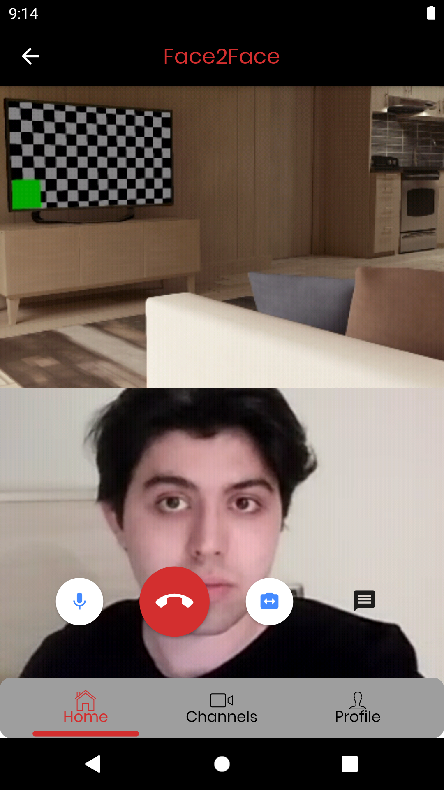
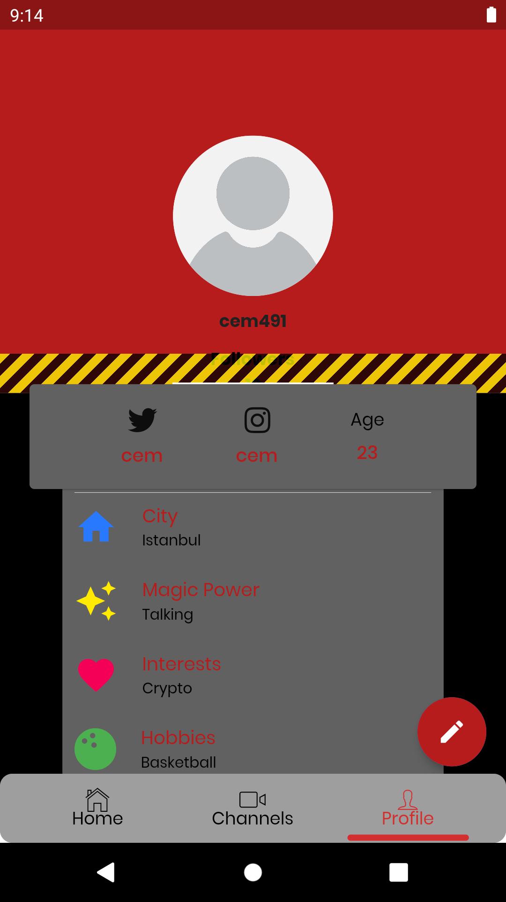

# FACE2FACE Group Video Call

A WebRTC Group Video Call application using Agora Video Call SDK, Cloud Firestore and Firebase Authentication built using Flutter.

         

 # Speech Recognition
 Speech Recognition is introduced in this video call application. This Added functionality in the group video call app is motivated by the desire to make speech impaired people's voice aloud on the live broadcast. Just click the youtube link to watch how it works.

 "https://www.youtube.com/embed/CeAAcLEYnQs"